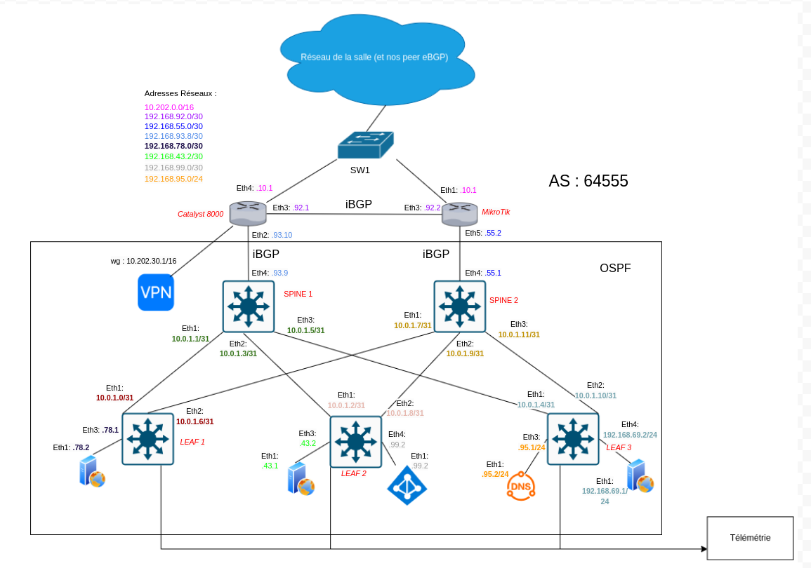

# SAé DevCloud_4D01: Développer et déployer un microservice dans un environnement virtualisé

Bienvenue sur le dépôt de la SAE DevCloud 4D01,de la team Yokoso : une infrastructure réseau automatisée, moderne et supervisée.

---

## 🗺️ Schéma réseau


> *Le schéma sera ajouté ici dès qu’il est prêt.*

---

## 🚀 Objectif

Déployer une architecture réseau complète intégrant :
- Routage dynamique (BGP, OSPF)
- VPN sécurisé
- DNS interne
- Supervision/monitoring
- Automatisation via Docker & Containerlab

---

## 📦 Déploiement rapide

```bash
git clone https://github.com/<votre-org-ou-utilisateur>/yokoso.git
cd yokoso
./deploy.sh
```
*Prérequis : Docker & Containerlab installés sur la machine.*

---


## ✍️ Auteurs

Enzo Dapra • Pierre Jaloghlian • Salah Boudina

---

Bonne découverte et n’hésitez pas à consulter la documentation pour plus de détails !
