<h1 style="color: #339CFF;">SAE </h1>

*L’objectif de cette SAE est de concevoir, déployer et valider une architecture réseau de type "leaf & spine" dans un environnement de datacenter simulé, en combinant des équipements physiques et virtualisés (Catalyst 8000, Mikrotik, Switch, routeurs containérisés via Containerlab). Notre mission consiste à assurer l’interconnexion, la haute disponibilité, la sécurité et la supervision des services (web, DNS, monitoring), tout en garantissant l’interopérabilité avec d’autres partenaires via BGP et un VPN Wireguard. L’ensemble du projet s’appuie sur une gestion en mode Kanban, avec validation régulière des jalons par le BBP, et une documentation complète des choix techniques et de la répartition des tâches au sein du groupe.*

---
<h1 style="color: #339CFF;">Schéma Représentatif</h1>


---
<h1 style="color: #339CFF;">Plan d'adressage</h1>

*Voici le plan d’adressage retenu pour l’ensemble des équipements de notre architecture.*

### Spine1
| Equipement | Interface   | Adresse IP      | Masque            | Description/Peer |
|------------|-------------|-----------------|-------------------|------------------|
| spine01    | Ethernet1   | 10.0.1.1        | 255.255.255.254   | to-leaf01        |
| spine01    | Ethernet2   | 10.0.1.3        | 255.255.255.254   | to-leaf02        |
| spine01    | Ethernet3   | 10.0.1.5        | 255.255.255.254   | to-leaf03        |
| spine01    | Ethernet4   | 192.168.93.9    | 255.255.255.252   | to-catalyst      |
| spine01    | Loopback0   | 10.255.0.1      | 255.255.255.255   | Loopback         |

### Spine2
| Equipement | Interface   | Adresse IP      | Masque            | Description/Peer |
|------------|-------------|-----------------|-------------------|------------------|
| spine02    | Ethernet1   | 10.0.1.7        | 255.255.255.254   | to-leaf01        |
| spine02    | Ethernet2   | 10.0.1.9        | 255.255.255.254   | to-leaf02        |
| spine02    | Ethernet3   | 10.0.1.11       | 255.255.255.254   | to-leaf03        |
| spine02    | Ethernet4   | 192.168.55.1    | 255.255.255.252   | to-mikrotik      |
| spine02    | Loopback0   | 10.255.0.2      | 255.255.255.255   | Loopback         |

### Leaf1
| Equipement | Interface   | Adresse IP      | Masque            | Description/Peer |
|------------|-------------|-----------------|-------------------|------------------|
| leaf01     | Ethernet1   | 10.0.1.0        | 255.255.255.254   | to-spine01       |
| leaf01     | Ethernet2   | 10.0.1.6        | 255.255.255.254   | to-spine02       |
| leaf01     | Ethernet3   | 192.168.94.1    | 255.255.255.252   | to-yokoso-web    |
| leaf01     | Ethernet4   | 192.168.95.1    | 255.255.255.0     | to-yokoso-dns    |
| leaf01     | Loopback0   | 10.255.0.11     | 255.255.255.255   | Loopback         |

### Leaf2
| Equipement | Interface   | Adresse IP      | Masque            | Description/Peer |
|------------|-------------|-----------------|-------------------|------------------|
| leaf02     | Ethernet1   | 10.0.1.2        | 255.255.255.254   | to-spine01       |
| leaf02     | Ethernet2   | 10.0.1.8        | 255.255.255.254   | to-spine02       |
| leaf02     | Loopback0   | 10.255.0.12     | 255.255.255.255   | Loopback         |

### Leaf3
| Equipement | Interface   | Adresse IP      | Masque            | Description/Peer |
|------------|-------------|-----------------|-------------------|------------------|
| leaf03     | Ethernet1   | 10.0.1.4        | 255.255.255.254   | to-spine01       |
| leaf03     | Ethernet2   | 10.0.1.10       | 255.255.255.254   | to-spine02       |
| leaf03     | Ethernet3   | 192.168.91.60   | 255.255.255.0     | to-wg-easy       |
| leaf03     | Loopback0   | 10.255.0.13     | 255.255.255.255   | Loopback         |
| leaf03     | Ethernet4   | 10.202.9.2      | 255.255.255.0     | to-PC-physique (optionnel) |

### Catalyst
| Equipement | Interface   | Adresse IP      | Masque            | Description/Peer |
|------------|-------------|-----------------|-------------------|------------------|
| catalyst   | Ethernet1   | 192.168.93.10   | 255.255.255.252   | to-spine01       |
| catalyst   | Loopback0   | 10.255.0.100    | 255.255.255.255   | Loopback         |

### Mikrotik
| Equipement | Interface   | Adresse IP      | Masque            | Description/Peer |
|------------|-------------|-----------------|-------------------|------------------|
| mikrotik   | Ethernet1   | 192.168.55.2    | 255.255.255.252   | to-spine02       |
| mikrotik   | Loopback0   | 10.255.0.200    | 255.255.255.255   | Loopback         |

### wg-easy
| Equipement | Interface   | Adresse IP      | Masque            | Description/Peer |
|------------|-------------|-----------------|-------------------|------------------|
| wg-easy    | eth1        | 192.168.91.61   | 255.255.255.0     | to-leaf03        |

### web
| Equipement | Interface   | Adresse IP      | Masque            | Description/Peer |
|------------|-------------|-----------------|-------------------|------------------|
| yokoso-web | eth1        | 192.168.94.2    | 255.255.255.252   | to-leaf01        |

### dns
| Equipement | Interface   | Adresse IP      | Masque            | Description/Peer |
|------------|-------------|-----------------|-------------------|------------------|
| yokoso-dns | eth1        | 192.168.95.2    | 255.255.255.0     | to-leaf01        |
---

<h2 style="color: #339CFF;">Gestion de Projet : utilisation de la méthode Kanban sur GitHub</h2>

Pour assurer un suivi rigoureux et transparent de l’avancement de notre projet, nous avons choisi d’utiliser la fonctionnalité **Projets** de GitHub, et plus particulièrement le modèle **Kanban** (voir image ci-dessous ). Ce choix nous a permis d’organiser efficacement les tâches, de répartir le travail entre les membres de l’équipe, et de garantir une validation régulière des jalons par le BBP (Big Boss Pouchou), conformément aux exigences du sujet.

Le tableau Kanban, accessible via l’onglet "Projects" du dépôt GitHub de notre groupe, se compose de plusieurs colonnes :  
- **À faire** : toutes les tâches identifiées mais non commencées  
- **En cours** : tâches en cours de réalisation  
- **Terminé** : tâches finalisées  
- **Idées Écartées** : éléments jugés non pertinents ou mis de côté


---

## Répartition et suivi des tâches par membre

### Détails horraires 


*Retrouvez ci-dessous la répartition synthétique des tâches réalisées par chaque membre.  
Pour un détail complet des tickets et du suivi, le fichier CSV est disponible [ici](repartition-taches.csv) dans le dépôt GitHub.*

### Enzo


### Salah


### Pierre


<h2 style="color: #339CFF;">Choix des Technos + Plan d'adressage avec son schéma</h2>


*Pour répondre efficacement aux besoins du projet, nous avons soigneusement sélectionné chaque technologie et protocole en fonction de leur pertinence, compatibilité et facilité de prise en main.*

---

### Routage dynamiquespine1# sh ip bgp neighbors 
BGP neighbor is 172.20.20.8, remote AS 64555, local AS 64555, internal link
  Local Role: undefined
  Remote Role: undefined
Hostname: leaf2
  BGP version 4, remote router ID 1.1.1.4, local router ID 1.1.1.1
  BGP state = Established, up for 00:00:56
  Last read 00:00:55, Last write 00:00:56
  Hold time is 180 seconds, keepalive interval is 60 seconds
  Configured hold time is 180 seconds, keepalive interval is 60 seconds
  Configured conditional advertisements interval is 60 seconds
  Neighbor capabilities:
    4 Byte AS: advertised and received
    Extended Message: advertised and received
    AddPath:
      IPv4 Unicast: RX advertised and received
    Long-lived Graceful Restart: advertised and received
      Address families by peer:
    Route refresh: advertised and received(old & new)
    Enhanced Route Refresh: advertised and received
    Address Family IPv4 Unicast: advertised and received
    Hostname Capability: advertised (name: spine1,domain name: n/a) received (name: leaf2,domain name: n/a)
    Graceful Restart Capability: advertised and received
      Remote Restart timer is 120 seconds
      Address families by peer:
        none
  Graceful restart information:
    End-of-RIB send: IPv4 Unicast
    End-of-RIB received: IPv4 Unicast
    Local GR Mode: Helper*
    Remote GR Mode: Helper
    R bit: True
    N bit: True
    Timers:
      Configured Restart Time(sec): 120
      Received Restart Time(sec): 120
    IPv4 Unicast:
      F bit: False
      End-of-RIB sent: Yes
      End-of-RIB sent after update: Yes
      End-of-RIB received: Yes
      Timers:
        Configured Stale Path Time(sec): 360
  Message statistics:
    Inq depth is 0
    Outq depth is 0
                         Sent       Rcvd
    Opens:                  1          1
    Notifications:          0          0
    Updates:                1          1
    Keepalives:             1          1
    Route Refresh:          0          0
    Capability:             0          0
    Total:                  3          3
  Minimum time between advertisement runs is 0 seconds

 For address family: IPv4 Unicast
  Update group 1, subgroup 1
  Packet Queue length 0
  Route-Reflector Client
  Community attribute sent to this neighbor(all)
  0 accepted prefixes

  Connections established 1; dropped 0
  Last reset 00:01:47,  No AFI/SAFI activated for peer
  Internal BGP neighbor may be up to 255 hops away.
Local host: 172.20.20.7, Local port: 179
Foreign host: 172.20.20.8, Foreign port: 48886
Nexthop: 172.20.20.7
Nexthop global: 3fff:172:20:20::7
Nexthop local: fe80::42:acff:fe14:1407
BGP connection: shared network
BGP Connect Retry Timer in Seconds: 120
Read thread: on  Write thread: on  FD used: 25

BGP neighbor is 172.20.20.9, remote AS 64555, local AS 64555, internal link
  Local Role: undefined
  Remote Role: undefined
Hostname: leaf1
  BGP version 4, remote router ID 1.1.1.3, local router ID 1.1.1.1
  BGP state = Established, up for 00:01:10
  Last read 00:00:10, Last write 00:00:10
  Hold time is 180 seconds, keepalive interval is 60 seconds
  Configured hold time is 180 seconds, keepalive interval is 60 seconds
  Configured conditional advertisements interval is 60 seconds
  Neighbor capabilities:
    4 Byte AS: advertised and received
    Extended Message: advertised and received
    AddPath:
      IPv4 Unicast: RX advertised and received
    Long-lived Graceful Restart: advertised and received
      Address families by peer:
    Route refresh: advertised and received(old & new)
    Enhanced Route Refresh: advertised and received
    Address Family IPv4 Unicast: advertised and received
    Hostname Capability: advertised (name: spine1,domain name: n/a) received (name: leaf1,domain name: n/a)
    Graceful Restart Capability: advertised and received
      Remote Restart timer is 120 seconds
      Address families by peer:
        none
  Graceful restart information:
    End-of-RIB send: IPv4 Unicast
    End-of-RIB received: IPv4 Unicast
    Local GR Mode: Helper*
    Remote GR Mode: Helper
    R bit: True
    N bit: True
    Timers:
      Configured Restart Time(sec): 120
      Received Restart Time(sec): 120
    IPv4 Unicast:
      F bit: False
      End-of-RIB sent: Yes
      End-of-RIB sent after update: Yes
      End-of-RIB received: Yes
      Timers:
        Configured Stale Path Time(sec): 360
  Message statistics:
    Inq depth is 0
    Outq depth is 0
                         Sent       Rcvd
    Opens:                  1          1
    Notifications:          0          0
    Updates:                1          1
    Keepalives:             2          2
    Route Refresh:          0          0
    Capability:             0          0
    Total:                  4          4
  Minimum time between advertisement runs is 0 seconds

 For address family: IPv4 Unicast
  Update group 1, subgroup 1
  Packet Queue length 0
  Route-Reflector Client
  Community attribute sent to this neighbor(all)
  0 accepted prefixes

  Connections established 1; dropped 0
  Last reset 00:01:47,  No AFI/SAFI activated for peer
  Internal BGP neighbor may be up to 255 hops away.
Local host: 172.20.20.7, Local port: 179
Foreign host: 172.20.20.9, Foreign port: 59798
Nexthop: 172.20.20.7
Nexthop global: 3fff:172:20:20::7
Nexthop local: fe80::42:acff:fe14:1407
BGP connection: shared network
BGP Connect Retry Timer in Seconds: 120
Estimated round trip time: 4 ms
Read thread: on  Write thread: on  FD used: 22

BGP neighbor is 172.20.20.10, remote AS 64555, local AS 64555, internal link
  Local Role: undefined
  Remote Role: undefined
Hostname: leaf3
  BGP version 4, remote router ID 1.1.1.5, local router ID 1.1.1.1
  BGP state = Established, up for 00:00:40
  Last read 00:00:39, Last write 00:00:40
  Hold time is 180 seconds, keepalive interval is 60 seconds
  Configured hold time is 180 seconds, keepalive interval is 60 seconds
  Configured conditional advertisements interval is 60 seconds
  Neighbor capabilities:
    4 Byte AS: advertised and received
    Extended Message: advertised and received
    AddPath:
      IPv4 Unicast: RX advertised and received
    Long-lived Graceful Restart: advertised and received
      Address families by peer:
    Route refresh: advertised and received(old & new)
    Enhanced Route Refresh: advertised and received
    Address Family IPv4 Unicast: advertised and received
    Hostname Capability: advertised (name: spine1,domain name: n/a) received (name: leaf3,domain name: n/a)
    Graceful Restart Capability: advertised and received
      Remote Restart timer is 120 seconds
      Address families by peer:
        none
  Graceful restart information:
    End-of-RIB send: IPv4 Unicast
    End-of-RIB received: IPv4 Unicast
    Local GR Mode: Helper*
    Remote GR Mode: Helper
    R bit: True
    N bit: True
    Timers:
      Configured Restart Time(sec): 120
      Received Restart Time(sec): 120
    IPv4 Unicast:
      F bit: False
      End-of-RIB sent: Yes
      End-of-RIB sent after update: Yes
      End-of-RIB received: Yes
      Timers:
        Configured Stale Path Time(sec): 360
  Message statistics:
    Inq depth is 0
    Outq depth is 0
                         Sent       Rcvd
    Opens:                  1          1
    Notifications:          0          0
    Updates:                1          1
    Keepalives:             1          1
    Route Refresh:          0          0
    Capability:             0          0
    Total:                  3          3
  Minimum time between advertisement runs is 0 seconds

 For address family: IPv4 Unicast
  Update group 1, subgroup 1
  Packet Queue length 0
  Route-Reflector Client
  Community attribute sent to this neighbor(all)
  0 accepted prefixes

  Connections established 1; dropped 0
  Last reset 00:01:47,  No AFI/SAFI activated for peer
  Internal BGP neighbor may be up to 255 hops away.
Local host: 172.20.20.7, Local port: 179
Foreign host: 172.20.20.10, Foreign port: 60716
Nexthop: 172.20.20.7
Nexthop global: 3fff:172 gardant la maîtrise sur les annonces.
- **OSPF** est employé pour le reste du réseau.  
  **Avantages :**
  - OSPF est rapide à converger et parfaitement adapté pour la diffusion automatique des routes dans une topologie leaf & spine.
  - Il limite les configurations manuelles et s’intègre bien avec les équipements virtuels comme Arista.
- **En résumé** : L’association iBGP (cœur du réseau, contrôle) + OSPF (distribution automatique, rapidité) permet d’avoir un routage efficace, souple et facile à superviser.

---

### Orchestration & virtualisation

- **Containerlab**  
  Nous avons choisi Containerlab plutôt que Netlab, car il offre une gestion complète, transparente et documentée de la topologie réseau.  
  > Netlab a tendance à “faire de la magie” et à masquer certains détails, alors que Containerlab permet de mieux comprendre et maîtriser chaque lien, chaque conteneur et chaque configuration réseau.

- **Arista** (pour les spines et leafs)  
  Nous avons privilégié les images Arista, car nous connaissons déjà bien cet environnement.  
  - Compatibilité supérieure avec les outils de monitoring, le routage dynamique et les scénarios multi-vendeurs (mieux que FRRouting dans ce contexte).
  - Interface CLI familière et documentation claire.

- **macvlan**  
  Utilisé pour assurer la liaison entre le monde physique (Catalyst, MikroTik) et le virtuel (Containerlab), via les spines.  
  - Permet une intégration transparente entre les conteneurs et les équipements physiques, sans NAT, et une gestion fine des VLAN.

---

### Administration et interconnexion

- **Pas d’iDRAC**  
  Nous n’avons pas retenu iDRAC, car dans notre cas, tous les accès se font en liaison directe et nous n’avions pas besoin d’administration distante avancée.
  - *Avantages d’iDRAC* : gestion serveur à distance, accès en cas de crash système.
  - *Inconvénients ici* : complexité supplémentaire, inutile dans une maquette “tout direct”, moins plug-and-play.
  - *Avantage de notre choix* : simplicité, moins de points de panne, déploiement rapide.

- **AS64555**  
  Utilisé pour rester dans la plage des AS privés (conforme aux bonnes pratiques pour les projets étudiants).

---

### VPN et sécurité

- **Wireguard Easy**  
  Nous avons choisi Wireguard Easy pour sa simplicité de déploiement, la génération et distribution automatique des clés, ainsi que la présence d’une interface web intuitive pour la gestion des pairs et des configurations.

---

### Supervision et monitoring

- **Uptime Kuma**  
  Nous avons sélectionné Uptime Kuma car c’est un outil de monitoring léger, visuel et facile à mettre en place.  
  Il permet de superviser simplement la disponibilité des services critiques (web, DNS, VPN…) avec alertes en cas d’incident.

- **Oxydyse**  
  Outil utilisé pour enregistrer automatiquement les “show run” de nos équipements réseau, assurant ainsi un archivage fiable des configurations et facilitant la traçabilité et la restauration en cas de besoin.

- **Grafana + GNMIC + Prometheus**  
  - **Prometheus** collecte les métriques réseau de façon centralisée.
  - **GNMIC** récupère les métriques via gNMI sur les équipements compatibles (notamment Arista).
  - **Grafana** offre un tableau de bord moderne, personnalisable et interactif pour visualiser en temps réel l’état du réseau, les performances et anticiper d’éventuels problèmes.

---

### Déploiement et portabilité

- **Docker packages avec dépôt personnel (ghcr.io)**  
  Nous avons packagé nos microservices dans des images Docker stockées sur le registre GitHub (ghcr.io), ce qui permet un déploiement rapide et reproductible, même en cas de changement de machine.  
  Les images sont “ready to use” pour Containerlab ou tout autre orchestrateur Docker.

---

**En résumé :**  
Ces choix nous ont permis de bâtir une infrastructure réseau complète, fiable, facilement supervisable et parfaitement adaptée à un contexte pédagogique et d’expérimentation.

<h2 style="color: #339CFF;">Configuration du Catalyst 8000</h2>---

## Prérequis

**Installation de picocom sur la machine :**  
```bash
apt install picocom
```

**Recherche du TTY :**  
```bash
dmesg | grep tty
```
Notre tty est le suivant : `/dev/ttyS0`

**Connexion série :**  
```bash
sudo picocom -b 9600 /dev/ttyS0
```

Appuyer sur entrée puis se connecter :  
- login : `admin`  
- mdp : `IutB2025?`  
- premier mdp a modifier : `Admin123#`

---

## Configuration initiale du Catalyst pour BGP

```shell
enable
configure terminal 
nfvis(config)# system settings mgmt ip address 10.202.158.69 255.255.0.0
nfvis(config)# system settings default-gw 10.202.255.254
nfvis(config)# system settings hostname c8200-1
nfvis# commit
nfvis(config)# end
nfvis# wr
```

**Pour désactiver le DHCP en cas de problème sur le Catalyst :**
```shell
nfvis(config)# no system settings wan dhcp
nfvis(config)# no bridges bridge wan-br dhcp
nfvis(config)# commit
Commit complete.
```

---

## Accès à l'interface Web Catalyst

Accéder à l’interface Web en entrant l’IP configurée : **10.202.158.69**

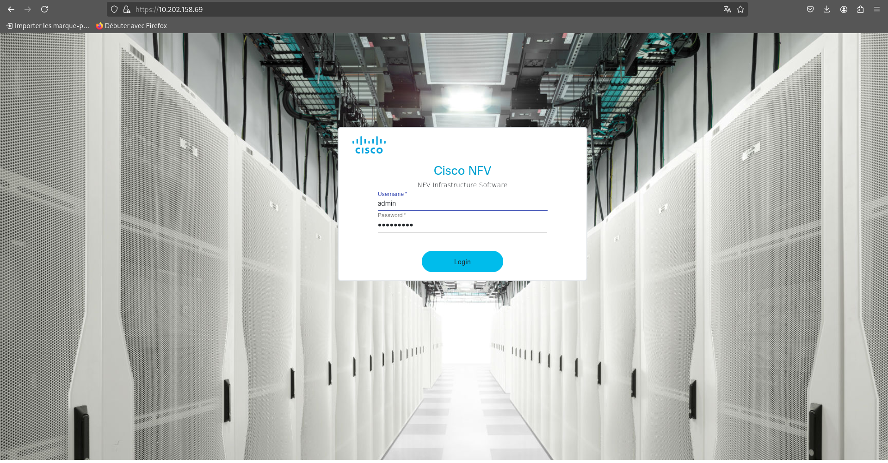

Après connexion, on arrive sur le dashboard :

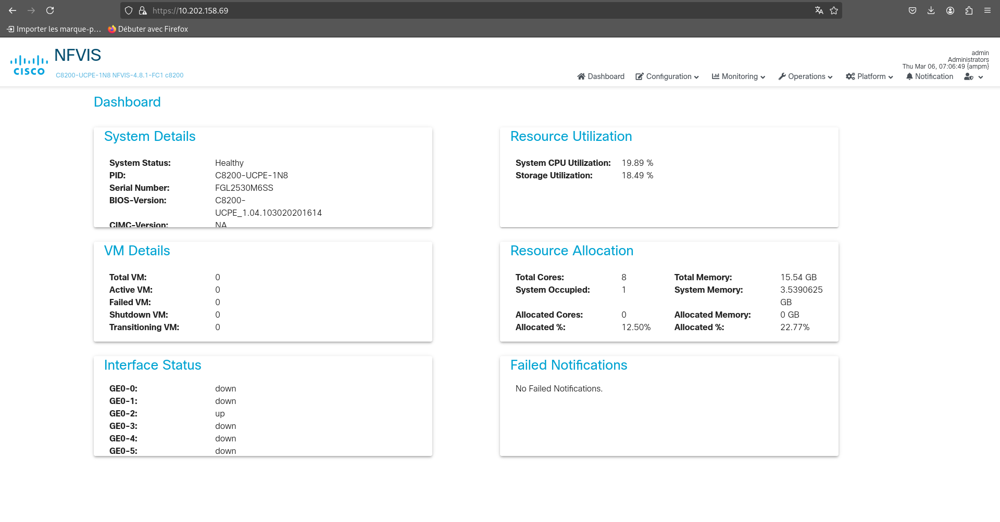

---

## Déploiement d’un Routeur sur le Catalyst

1. **Récupérer le fichier sur Nextcloud :**  
   `c8000v-universalk9_16G_serial.17.06.01a.tar.gz`

2. **Ajout de l’image dans l’interface :**  
   Aller dans **Configuration → Virtual Machine → images → Images Repository**

   

3. **Création du profil pour le routeur :**

   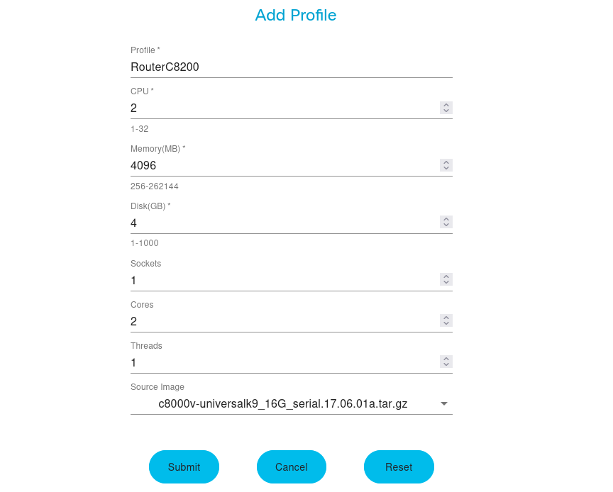

   Grâce au tar.gz, des profils “petit”, “moyen” et “grand” sont créés automatiquement selon les besoins.

   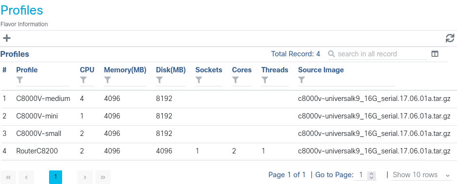

4. **Déploiement de la VM routeur via l’interface graphique :**

   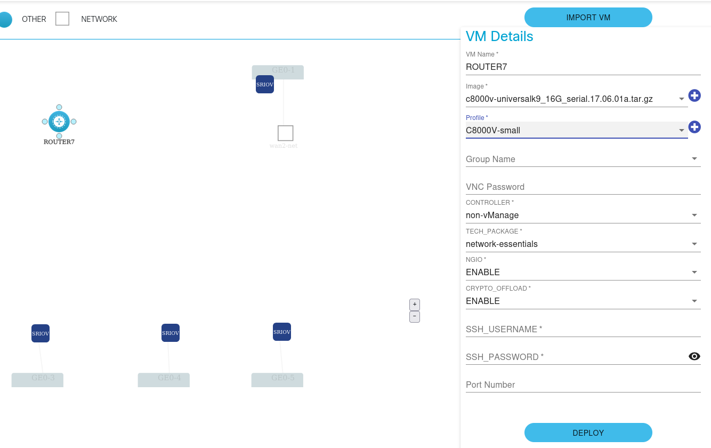

   Attendre quelques dizaines de secondes que la VM se déploie, puis vérifier sa présence dans **VM Manage** :

   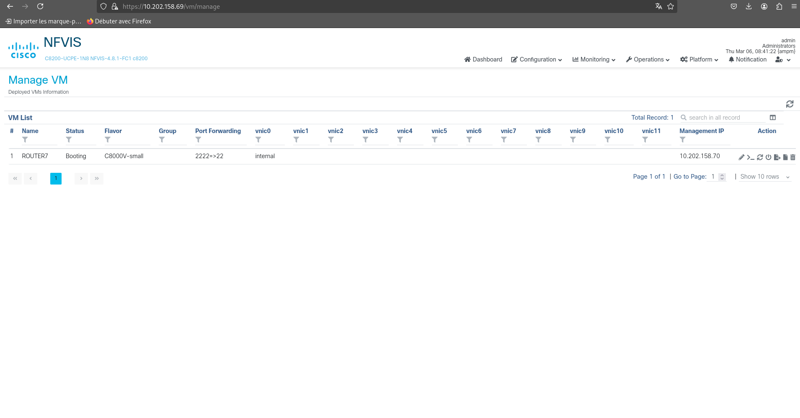

   **NB :** Mot de passe VM administrateur : `AdmininstrateurIutB2025TTadmin_@@@@`

---

## Connexion et configuration du routeur

1. **Accès console au routeur "ROUTER7"**  
   Depuis la CLI nfvis :  
   ```bash
   vmConsole ROUTER7
   ```

2. **Passer les interfaces en UP**
   ```shell
   no shutdown
   ```

3. **Affecter les adresses IP**

   - **Sortie salle Ge0/2 et 4 (virt) :**
     ```shell
     ip address 10.202.10.1 255.255.0.0
     no shut
     ```

   - **Côté Containerlab Ge0/0 et 2 (virt) :**
     ```shell
     ip address 192.168.93.10 255.255.255.252
     ip address 192.168.254.1 255.255.255.252
     no shut
     ```

---

## Configuration BGP et voisins

```shell
router bgp 64555
neighbor 10.202.159.250 remote-as 100        // Catalyst Ng Pao Mathias Ludovic  
neighbor 10.202.159.251 remote-as 100        // Microtik Ng Pao Mathias Ludovic  
neighbor 10.202.1.11 remote-as 1713          // Romain Nathan  
neighbor 10.202.1.50 remote-as 1713          // Romain Nathan  
neighbor 192.168.254.2 remote-as 64555       // ibgp
```

---

## Vérification BGP

On atteste du fonctionnement avec les résultats suivants :

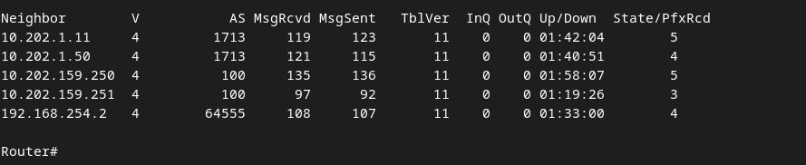

---

## Divers

- **Reset Catalyst (hors images) :**
  ```shell
  factory-default-reset all-except-images
  ```

---

## Questions / Problèmes rencontrés

- **Question :** Comment ça se fait que quand j’ajoute un management sur mon iutbrt2024 [...] ?
- **À compléter selon les retours d’expérience ou questions supplémentaires.**

---

<h2 style="color: #339CFF;">Configuration du MikroTik</h2>

## 1. Préparation de l’équipement

Sur le MikroTik, on a supprimé tous les bridges, à part l’interface loopback qui reste en bridge.  
Toutes les autres interfaces Ethernet (ether1, ether2, etc.) fonctionnent en mode "normal" (pas en bridge).  
De cette manière, on aura pas de problème de switch sur nos ports:

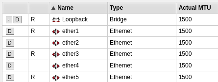

---

## 2. Attribution des adresses IP

Nous avons ensuite configuré les adresses IP sur les différents ports :
- Un lien vers la salle : IP **10.202.20.1/16** sur **ether1**
- Un lien vers le Catalyst : IP **192.168.92.2/30** sur **ether3**
- Un lien vers le Spine 2 : IP **192.168.55.2/30** sur **ether5**
- Une IP de loopback : **10.255.0.254/32**
- Un port de sécurité : IP **192.168.1.1/24** sur **ether4**
  (pour avoir un accès en cas de perte des autres IP pour configurer le mikrotik)

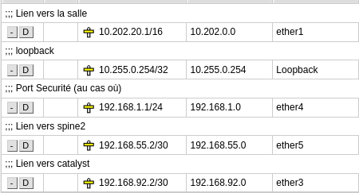

---

## 3. Configuration du DHCP

Nous avons laissé le serveur DHCP actif sur le port de sécurité (ether4) pour faciliter l’accès en cas de besoin :

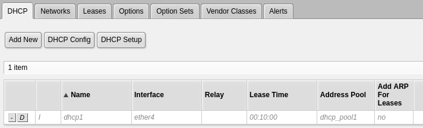

Il est grisé sur l'image car il n'y a aucun appareil qui utilise le service.

---

## 4. Mise en place du BGP

Pour faire du routage dynamique avec nos collègues, les spines et le Catalyst, nous avons configuré BGP sur le Mikrotik.  
Nous avons déclaré nos voisins, renseigné l’adresse distante ainsi que l’AS distante.

Voici ici tout nos peers, qui sont a l'état **established** :

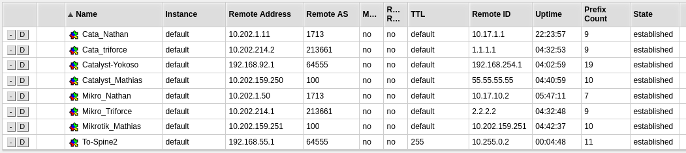

Voici ici les **réseaux** que nous **annonçons** par BGP:

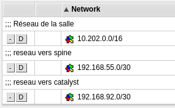

---

## 5. Supervision du peering BGP

Dans l’onglet **Advertisements**, nous retrouvons l’ensemble des annonces de routes effectuées par nos voisins :

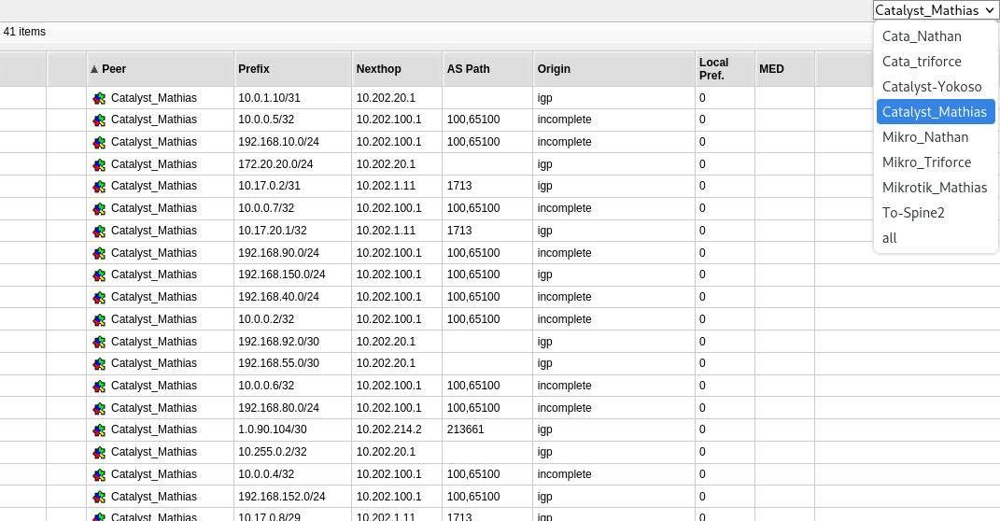

---

## 6. Vérification des routes

Enfin, il est possible de vérifier l’ensemble des routes apprises en ligne de commande avec `/ip route print`, ce qui permet de voir la cohérence du routage, et nous voyons bien les routes :

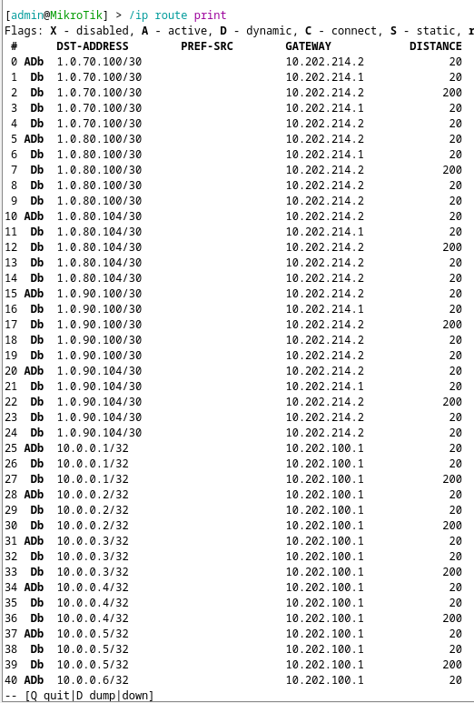

---

## 7. Backup du Mikrotik

Nous avons régulièrement effectué des backup du mikrotik pour éviter des problèmes de pertes de données pour X raisons. Pour cela, nous nous sommes rendus dans Files puis Backup:

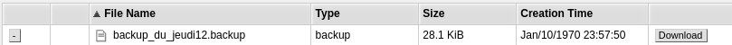


<h2 style="color: #339CFF;">Configuration de Containerlab</h2>

<h2 style="color: #339CFF;">Ajout des micro services</h2>

Nous avons pu joindre notre serveur web en mettant une route vers l'adresse du réseau du **container web** sur la machine qui est dans la salle, puis nous avons fait un **curl** de l'ip. Nous voyons bien que nous avons accès au serveur web.

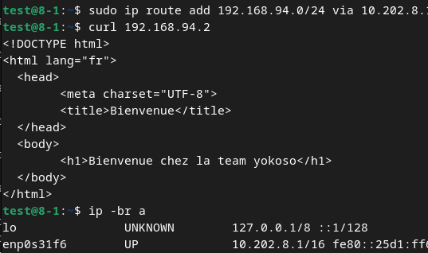

Nous y avons aussi accès par **interface web** (preuve plus esthétique) :


<h2 style="color: #339CFF;">Intégration VPN avec wireguard</h2

Pour l'intégration du VPN nous avons opté pour Wireguard Easy une solution qui simplifie le démarrage de notre wireguard avec un container et qui va générer les conf prête a l'emploi pour le client. 

- **Récupération de l'image:**
  ```shell
  docker pull weejewel/wg-easy:latest
  ```

- **Modification du docker compose**
```shell
volumes:
  etc_wireguard:

services:
  wg-easy:
	environment:
  	- PORT=51821
  	- HOST=0.0.0.0
  	- INSECURE=true

	image: ghcr.io/wg-easy/wg-easy:15
	container_name: wg-easy
	networks:
  	wg:
    	ipv4_address: 10.202.30.1
	volumes:
  	- etc_wireguard:/etc/wireguard
  	- /lib/modules:/lib/modules:ro
	ports:
  	- "51820:51820/udp"
  	- "51821:51821/tcp"
	restart: unless-stopped
	cap_add:
  	- NET_ADMIN
  	- SYS_MODULE
	sysctls:
  	- net.ipv4.ip_forward=1
  	- net.ipv4.conf.all.src_valid_mark=1

networks:
  wg:
	driver: macvlan
	enable_ipv6: false
	driver_opts:
  	parent: enp0s31f6
	ipam:
  	config:
    	- subnet: 10.202.0.0/16
      	gateway: 10.202.10.1


```


Le bon fonctionnement de WireGuard est confirmé par la présence du point rouge indiquant une connexion active, ainsi que par l’affichage des débits en émission et en réception.

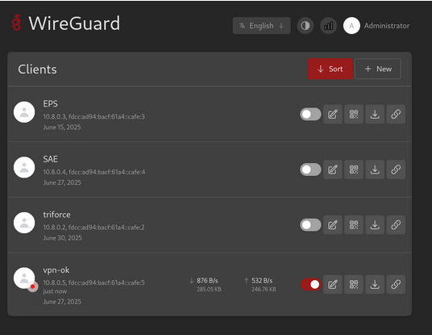

## Partie client ##
 creation du wg0.conf :

 `nano wg0.conf `
```
[Interface]
PrivateKey = OOneb7ESOy06kfgS3ISj4I7MfAGwFIbMka4aBCi79F0=
Address = 10.8.0.5/24, fdcc:ad94:bacf:61a4::cafe:5/112
DNS = 1.1.1.1, 2606:4700:4700::1111
MTU = 1420

[Peer]
PublicKey = ua5pK/+TZK1H+XCd1/zDuek1JtHV19t4Zb2VGg1Qcjg=
PresharedKey = fVxfg7BMOq3uFgDbxeaPg+KFtgz6C2/bjOKJUt21z60=
AllowedIPs = 0.0.0.0/0, ::/0
PersistentKeepalive = 0
Endpoint = 10.202.30.1:51820

```
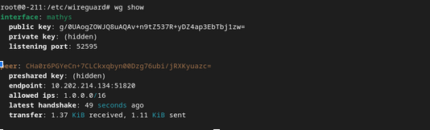


le groupe de mathis qui est depuis son datacenter arrive a acceder aux serveur dns dans notre data center grace aux vpn :

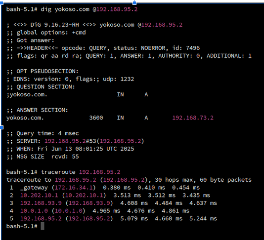

nous accedons aussi aux leur grace aux vpn :

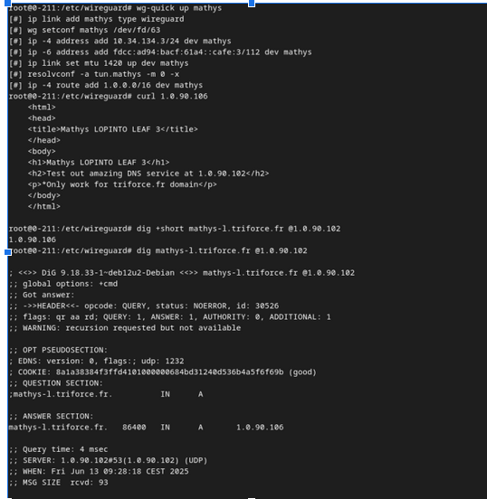
---
<h2 style="color: #339CFF;">Monitoring/Supervision</h2>

#  Mise en place de la télémétrie avec gNMI

##  Objectif

 j’ai mis en place une solution de **télémétrie réseau avec gNMI** pour superviser en temps réel les performances de mes routeurs **Arista cEOS** déployés dans une topologie **Leaf & Spine** avec Containerlab.

Le but était de collecter automatiquement des métriques réseau (trafic, CPU, interfaces, etc.) et de les visualiser via une stack d’observabilité moderne (Prometheus + Grafana).

---

##  Architecture mise en place

- 5 routeurs Arista cEOS : `leaf1`, `leaf2`, `leaf3`, `spine1`, `spine2`
- Collecteur télémétrique : `gnmic` (récupère les données via gNMI)
- Base de données de séries temporelles : `Prometheus`
- Interface de visualisation : `Grafana`

---

##  Étapes de mise en place

### 1. Activer le service gNMI sur chaque routeur Arista

Sur chaque cEOS, j’ai activé l’API gNMI en CLI comme ceci :

```bash
conf t
management api gnmi
   transport grpc default
   no shutdown
   username gnmiuser password MonMotDePasse123
```
# 2. Écrire le fichier gnmic.yaml

J’ai ensuite écrit un fichier de configuration gnmic.yaml pour connecter gnmic à tous mes routeurs et définir les métriques à collecter.

```

targets:

  leaf1:
    address: 172.20.20.3:6030
    username: gnmiuser
    password: MonMotDePasse123
    insecure: true

  leaf2:
    address: 172.20.20.6:6030
    username: gnmiuser
    password: MonMotDePasse123
    insecure: true

  leaf3:
    address: 172.20.20.4:6030
    username: gnmiuser
    password: MonMotDePasse123
    insecure: true

  spine1:
    address: 172.20.20.5:6030
    username: gnmiuser
    password: MonMotDePasse123
    insecure: true

  spine2:
    address: 172.20.20.2:6030
    username: gnmiuser
    password: MonMotDePasse123
    insecure: true

subscriptions:

    #Interface Ethernet1 état + compteurs
  ethernet1-state:
    paths:
      - /interfaces/interface[name=Ethernet1]/state
      - /interfaces/interface[name=Ethernet1]/state/counters
    stream-mode: sample
    sample-interval: 5s

   #4. 5. BGP neighbors et état session
  bgp-neighbors-state:
    paths:
      - /network-instances/network-instance[name=default]/protocols/protocol[identifier=BGP][name=BGP]/bgp/neighbors/neighbor
      - /network-instances/network-instance[name=default]/protocols/protocol[identifier=BGP][name=BGP]/bgp/neighbors/neighbor/state/session-state
    stream-mode: sample
    sample-interval: 20s
    format: prom

  #6. Toutes les infos de l’équipement (system subtree)
  system-info:
    paths:
      - /system
    stream-mode: sample
    sample-interval: 60s

   #7. Etat mémoire
  memory-state:
    paths:
      - /system/memory/state
    stream-mode: sample
    sample-interval: 15s

   #8. Nombre de CPU en format flat
  cpu-info-flat:
    paths:
      - /system/cpus/cpu
    stream-mode: sample
    sample-interval: 15s
    output: flat


   #10. Souscrire aux compteurs interface Ethernet1 toutes les 5s
  ethernet1-counters-sub:
    paths:
      - /interfaces/interface[name=Ethernet1]/state/counters
    stream-mode: sample
    sample-interval: 5s

  #11. Récupérer les routes BGP (attention à la hiérarchie précise)
  bgp-routes:
    paths:
      - /network-instances/network-instance[name=default]/protocols/protocol[identifier=BGP][name=BGP]/bgp/rib/afi-safis/afi-safi/ipv4-unicast/loc-rib/routes/route
    stream-mode: sample
    sample-interval: 30s
    format: prom

  #12. Processus et leur nombre
  processes-info:
    paths:
      - /system/processes/process
    stream-mode: sample
    sample-interval: 30s

outputs:
  prometheus:
    type: prometheus
    listen: ":9804"

api-server:
  enable-metrics: true
  enable-pprof: true
  address: ":9804"

logging:
  level: info
  format: console
# Ensuite, j’ai configuré Prometheus pour récupérer les données de gnmic:
global:
  scrape_interval: 10s

scrape_configs:
  - job_name: 'gnmic'
    static_configs:
      - targets: ['10.202.0.121:9804']

    # Lancer Prometheus  gnmic et Grafana via Docker
```

J’ai ensuite utilisé un fichier docker-compose.yml pour lancer Prometheus gnmic, et Grafana ensemble: 

```yaml
version: '3.8'

services:
  prometheus:
    image: prom/prometheus:latest
    container_name: prometheus
    volumes:
      - ./prometheus.yml:/etc/prometheus/prometheus.yml
    ports:
      - "9090:9090"
    networks:
      - monitor-net

  grafana:
    image: grafana/grafana:latest
    container_name: grafana
    ports:
      - "3000:3000"
    environment:
      - GF_SECURITY_ADMIN_PASSWORD=admin
    volumes:
      - grafana_data:/var/lib/grafana
    networks:
      - monitor-net

  gnmic:
    image: ghcr.io/openconfig/gnmic:latest
    container_name: gnmic
    volumes:
      - ./gnmic.yaml:/app/gnmic.yaml
    command: ["subscribe", "--config", "/app/gnmic.yaml"]
    ports:
      - "9804:9804"
    networks:
      - monitor-net
    depends_on:
      - prometheus

volumes:
  grafana_data:

networks:
  monitor-net:
    driver: bridge
```
 Puis je lance le tout avec la commande suivante :

`docker-compose up -d`

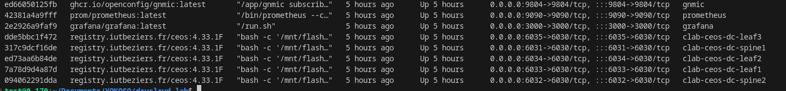

#  Ajouter Prometheus comme source de données dans Grafana

Une fois Grafana lancé (par défaut sur le port 3000), je me suis connecté à l’interface web :

 URL : http://localhost:3000
Login : admin / admin 

Dans Grafana :
    Je vais dans "Settings > Data Sources"
    Je clique sur "Add data source"
    Je choisis Prometheus
    je rentre l’URL : http://prometheus:9090
    apres save et test
    et nous avons acces a nos metric

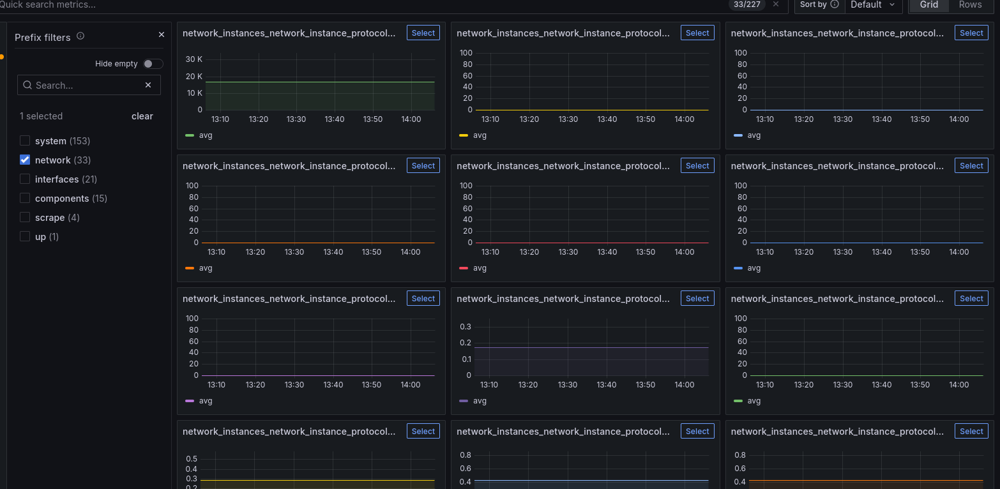

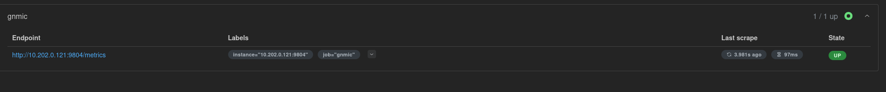


# Pour envoyer des données il faut d'abord installer gnmic 
curl -sSL https://raw.githubusercontent.com/openconfig/gnmic/main/install.sh | bash

Puis envoyer les données c'est avec cette commande :
gnmic --config gnmic.yaml subscribe -d

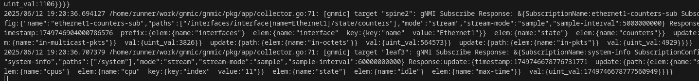


on peux verifier si nous avons bien recus les données sur le liens ou le curl :

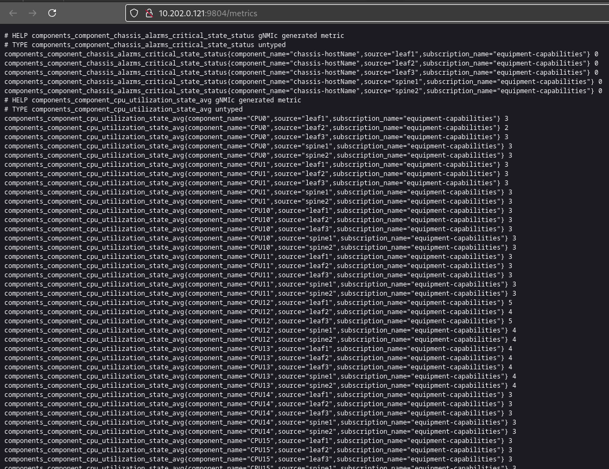


# Dockerfile FRRouting (FRR)

j'ai créé un Dockerfile permettant de construire une image Docker basée sur FRRouting (FRR). FRRouting est du routage dynamique très utilisée pour gérer des protocoles comme BGP (Border Gateway Protocol) et OSPF. Ce Dockerfile a pour but de configurer un container avec FRR activé, prêt à faire du routage dynamique pour des tests et simulations réseau.

# 2. Description de ce que j'ai fait dans le Dockerfile

FROM frrouting/frr:latest

RUN sed -i 's/bgpd=no/bgpd=yes/' /etc/frr/daemons && \
    sed -i 's/zebra=no/zebra=yes/' /etc/frr/daemons && \
    chown frr:frr /etc/frr/*


EXPOSE 179/tcp
EXPOSE 2601/tcp
EXPOSE 2604/tcp


Base de l'image :J'ai utilisé l'image officielle frrouting/frr:latest qui contient déjà une installation complète de FRR.

Activation des daemons nécessaires :Par défaut, FRR désactive certains services. J'ai modifié le fichier /etc/frr/daemons pour activer :

bgpd (le démon BGP), qui permet la gestion des sessions BGP.

zebra, qui est le démon central gérant la table de routage.

Cette activation est réalisée grâce à des commandes sed qui remplacent les lignes bgpd=no et zebra=no par bgpd=yes et zebra=yes.

Gestion des droits :J'ai également changé la propriété des fichiers de configuration FRR (/etc/frr/*) au groupe et utilisateur frr pour éviter des problèmes de permission lors du lancement des services.

Ouverture des ports :J'ai exposé les ports nécessaires :

179/TCP : port standard utilisé par BGP pour établir les sessions entre routeurs.

2601/TCP et 2604/TCP : ports spécifiques à FRR pour la communication interne (par exemple VTY pour les sessions telnet/ssh vers FRR).

# 3. À quoi sert ce Dockerfile ?

Ce Dockerfile sert à construire une image Docker prête à faire du routage BGP. Cette image peut être utilisée pour simuler un routeur BGP dans un environnement virtualisé, ce qui est très utile pour :

Tester des configurations BGP sans matériel physique.

Intégrer dans des topologies réseau simulées (avec Docker Compose ou Containerlab).

Faciliter l’apprentissage et le déploiement rapide de routeurs FRR dans des environnements cloud ou locaux.

# 4. Comment lancer ce Dockerfile ?

Voici les étapes pour construire et lancer un container à partir de ce Dockerfile :

Construction de l'image :Depuis le dossier où se trouve le Dockerfile, lancer la commande :docker build -t frr-custom -f Dockerfile.frr .


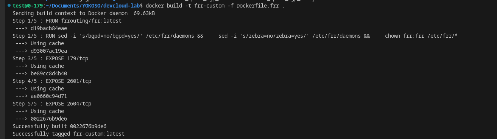


# 5 .Déploiement de la topologie avec Containerlab :
Après avoir construit et lancé cette image, il faudra créer un fichier YAML décrivant la topologie réseau, par exemple leaf-spine.clab.yml.


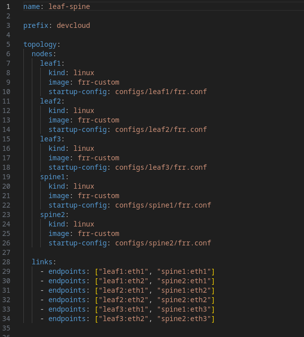


Pour déployer la topologie, il suffit ensuite de lancer la commande :

sudo containerlab deploy -t leaf-spine.clab.yml

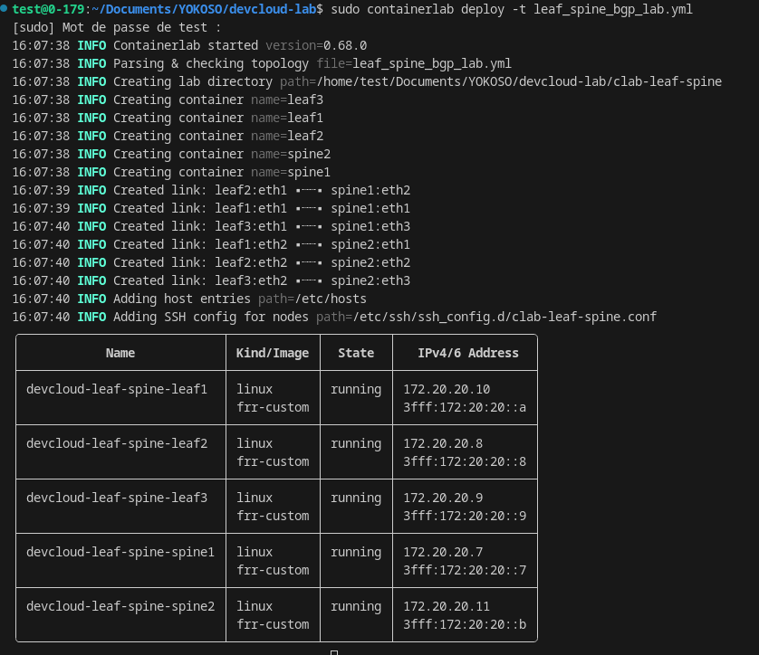

Cette commande va automatiquement déployer les containers basés sur l’image FRR configurée et interconnecter les routeurs selon la topologie définie.


voici le drawio:


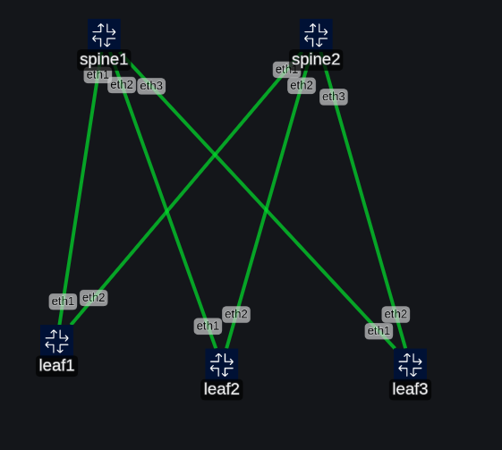

voici les commandes a taper dans chaque routeur pour mettre en place le bgp :

```
Configurations BGP 
Spines (route-reflectors)
 Spine1 (172.20.20.7)
configure terminal
router bgp 64555
 bgp router-id 1.1.1.1
 bgp cluster-id 1.1.1.1
 bgp log-neighbor-changes
 neighbor 172.20.20.9 remote-as 64555
 neighbor 172.20.20.9 route-reflector-client
 neighbor 172.20.20.8 remote-as 64555
 neighbor 172.20.20.8 route-reflector-client
 neighbor 172.20.20.10 remote-as 64555
 neighbor 172.20.20.10 route-reflector-client
 address-family ipv4 unicast
  neighbor 172.20.20.9 activate
  neighbor 172.20.20.8 activate
  neighbor 172.20.20.10 activate
 exit-address-family
end
write


Spine2 (172.20.20.11)
configure terminal
router bgp 64555
 bgp router-id 1.1.1.2
 bgp cluster-id 1.1.1.2
 bgp log-neighbor-changes
 bgp log-neighbor-changes
 neighbor 172.20.20.9 remote-as 64555
 neighbor 172.20.20.9 route-reflector-client
 neighbor 172.20.20.8 remote-as 64555
 neighbor 172.20.20.8 route-reflector-client
 neighbor 172.20.20.10 remote-as 64555
 neighbor 172.20.20.10 route-reflector-client
 address-family ipv4 unicast
  neighbor 172.20.20.9 activate
  neighbor 172.20.20.8 activate
  neighbor 172.20.20.10 activate
 exit-address-family
end
write


Leafs (leaf1, leaf2, leaf3)
Leaf1 (172.20.20.9)
configure terminal
router bgp 64555
 bgp router-id 1.1.1.3
 bgp log-neighbor-changes
 neighbor 172.20.20.7 remote-as 64555
 neighbor 172.20.20.11 remote-as 64555
 address-family ipv4 unicast
  neighbor 172.20.20.7 activate
  neighbor 172.20.20.11 activate
 exit-address-family
end
write


Leaf2 (172.20.20.8)
configure terminal
router bgp 64555
 bgp router-id 1.1.1.4
 bgp log-neighbor-changes
 neighbor 172.20.20.7 remote-as 64555
 neighbor 172.20.20.11 remote-as 64555
 address-family ipv4 unicast
  neighbor 172.20.20.7 activate
  neighbor 172.20.20.11 activate
 exit-address-family
end
write


 Leaf3 (172.20.20.10)
configure terminal
router bgp 64555
 bgp router-id 1.1.1.5
 bgp log-neighbor-changes
 neighbor 172.20.20.7 remote-as 64555
 neighbor 172.20.20.11 remote-as 64555
 address-family ipv4 unicast
  neighbor 172.20.20.7 activate
  neighbor 172.20.20.11 activate
 exit-address-family
end
write
```

on peut voir que les bgp est bien mit en place et que j'arrive a ping tout le monde :
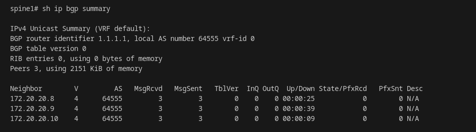


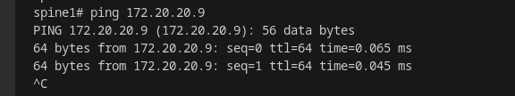


# kuma 

Nous avons mis en place Update Kuma comme outil de supervision afin de surveiller l’état de différents services critiques de mon infrastructure. Plus précisément, j’ai configuré des vérifications régulières pour :

  Le DNS, afin de m’assurer que la résolution de noms fonctionne correctement.

 Le service LDP (Label Distribution Protocol), pour vérifier la bonne distribution des labels dans le réseau MPLS.

  Le HAProxy, pour contrôler le bon fonctionnement du répartiteur de charge et garantir l’accessibilité des services derrière le proxy.

Ces vérifications permettent de détecter rapidement toute anomalie et d'assurer une disponibilité optimale des services supervisés.

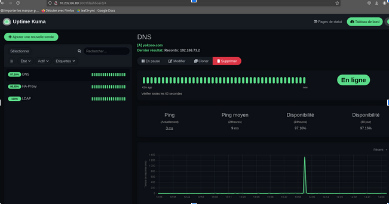


<h2 style="color: #339CFF;">Problème Rencontré</h2>

Nous avons rencontré de nombreux problèmes

<h2 style="color: #339CFF;">sources</h2>
